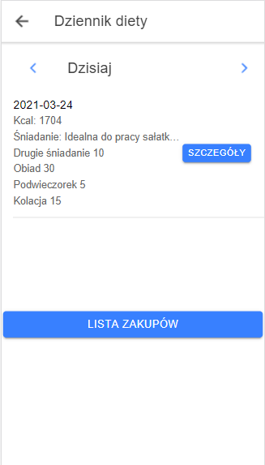
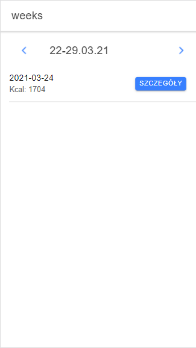
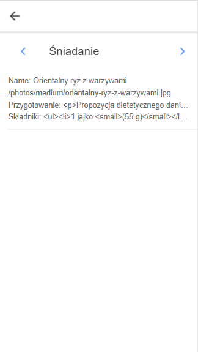
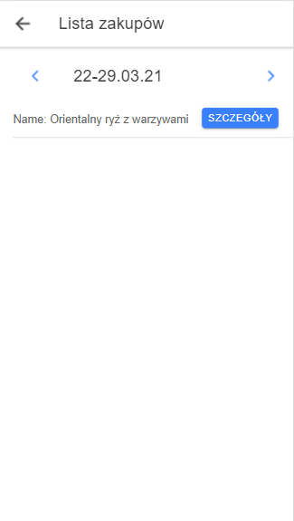

# DietDiary-FrontEnd Ionic, Angular APP
> It's frontend of recpies app. Make with Ionic, Angular framework.
## Table of contents
* [Screenshots](#screenshots)
* [Technologies](#technologies)
* [Setup](#setup)
* [Features](#features)
* [Status](#status)
* [Inspiration](#inspiration)
* [Contact](#contact)
## Screenshots




## Technologies
* Ionic - version 6.13.1
* Angular - version 11.2.5
## Setup
Run with `ionic serve`.
## Code Examples
Show examples of usage:
`put-your-code-here`
	```ruby  
	private static String updateWeatherIcon(int condition){}
	```
## Features
List of features ready and TODOs for future development
* Awesome feature 1
* Awesome feature 2
* Awesome feature 3
To-do list:
* Wow improvement to be done 1
* Wow improvement to be done 2
## Status
Project is: _in progress_.
## Inspiration
Project inspired by bharathirajatut, "Add To Cart Example Using PHP, MySQL"
https://github.com/bharathirajatut/ionic4-higher-example/tree/master/cart-crud-php-mysql-example
## Contact
Created by Damian Jaszewski damianjaszewski@gmail.com - feel free to contact me!
